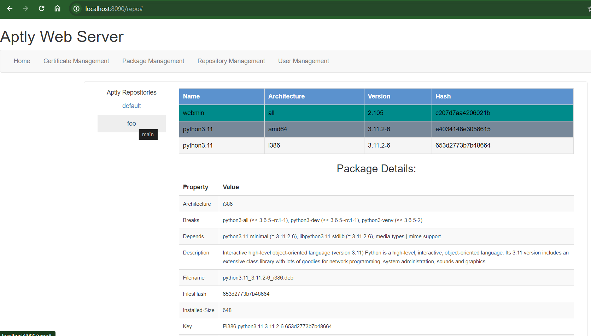

# Aptly Website

The Aptly Website will serve as a general interface to activate features within an Aptly API server. Written in python, using Falcon as the framework, Jinja for the web template, and Jinja as the gateway interface.

